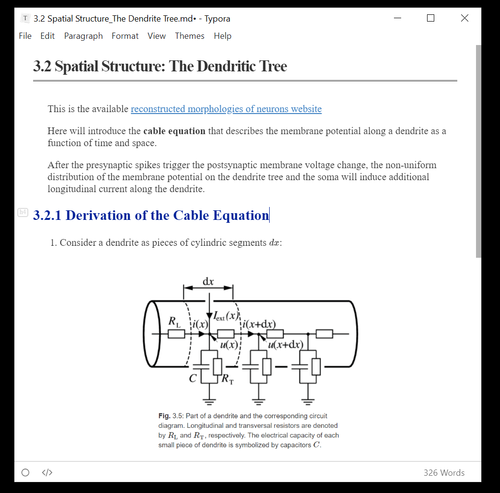

# Typora_my_theme

> This is a typora theme modified from the default theme [github](http://theme.typora.io/theme/Github/).

## Introduction

[Typora](https://www.typora.io/) is a markdown editor and reader that supports real-time preview. It supports `Windows`, `macOS`, `Linux` platforms. Typora is a qualified Markdown editor that supports images, lists, tables, codes, formulas, catalogs, etc. At the same time, typora also supports (one-click) dynamic preview function, so that everything becomes so clean and pure. And there are various theme templates. **[Typora_my_theme](https://github.com/CnDE-M/Typora_my_theme) is modified from the default theme [github](http://theme.typora.io/theme/Github/)**.

## Install

1. [Download](https://codeload.github.com/CnDE-M/Typora_my_theme/zip/master) this theme from Github, then you can get the `mytheme.css` and the `mytheme` folder.
2. Open typora. Click "**Open Theme Folder**" button from `Preference Panel` → `Appearance` section.
3. Put `mytheme.css` and `mytheme` folder into the opened folder, make sure your css files are directly under that directory.
4. Close and reopen Typora and select `Theme` → `mytheme` from the menu bar.

## Screenshots

